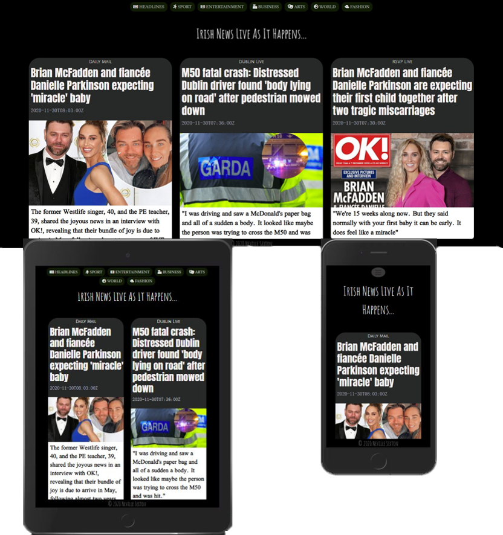

# Neville Sexton - Newsround

## Code Institute - Milestone ProjectII: Interactive frontend Development.

Newsround is a simple javascript powered application for pulling irish based news stories together. Targetting the GNews.io API this application pulls 10 articles per category,
as defined by the menu buttons, and displays them in brief bite-sized summaries with links to the main articles themselves.

This is the second of 4 milestone projects for The Code Institute's Diploma in Full Stack Software Development and is designed to showcase an understanding of javascript/jquery 
based coding married to the HTML and CSS previously covered in the first milestone project. 

The github repository for this project is located [here](https://github.com/nevdevtrev/milestoneproj2-IFD.git) with the live site [here](https://nevdevtrev.github.io/milestoneproj2-IFD/)

## Technologies Used

### Languages / Frameworks / IDEs / Repositories
1. HTML5
2. Boostrap 4 framework
3. Flexbox Grid System
4. CSS3
5. JavaScript
6. Github
7. Gitpod

### Other Tools

1. Fontawesome
2. Google Fonts
3. W3C CSS Validation Service
4. W3C HTML Validation Service
5. BeautifyTools Javascript Validation Service
6. Autoprefixer CSS cross browser compatibility tool
7. Chrome Developer Tool

## Design - UX

### Design Process

#### Scope Plane

This site is aimed at users who want quick and summaried up-to-date news headlines. It default displays the top 10 headlines of the moment and further provides 
the user with topical choices within the navbar for their own selection. Each summaried article offers a link to the source site for the full detailed article 
should the user wish to read more.

#### Structure Plane

The structural idea behind this site was to keep it simple. It is a single page website where all articles display across one, two, or three columns depending
on the device being used - from mobile(1 col) to desktop(3 col). Each button will call 10 articles in accordance with that button's subject topic and 
these will replace the previously called articles.

#### Skeleton Plane

The outline wireframe drawings for this site are located [here](assets/images/wirframe/wireframe.jpg). This is the fundamental outline of how the site renders across differing devices

#### Surface Plane 

The app is designed as a mobile first single page site with top navigation bar links (collapsible on small devices) to a selection of
news categories, namely: 'Headlines', 'Sport', 'Business', 'Arts', 'Fashion', 'World' and 'Entertainment'. The main body of the page is where the 
articles are displayed and to finish off I've utilised a fixed footer with basic copyright information. 

Within the navigation bar each category is a separate menu button keeping the experience as simple and straight-forward as possible. Each button
will cause the screen to be filled with the 10 related articles called and all laid out through the use of bootstrap frameworks responsive design. 

The navbar, and toggler icon, is degined to disappear off screen as soon as scrolling downwards occurs. This is especially appreciated on smaller
mobile devices where screen space is premium.

### Design Features

The site is laid out using the flexbox grid system and Bootstrap Framework. To facilitate a responsive layout I created an array (divs) comprised of 10 distinct 
div ids to be used within an iterating for loop for assigning each article to distinct document.getElementById(divs[i]) elements. Once each article
is distributed to separate divs I could then use the row/col structure for subsequent responsive layout. 

A retracting navbar holds category-based buttons. Button design and responsiveness was built upon bootstrap button classes. However these were heavily modified for colouring, bordering, box shadowing
across the differing states of hover/active/focus etc.

Each article layout sits within a uniformly designed css styled list element, which is reproduced within a unique div element for responsive rendering

### Future Features

Use of a user inputted search option will be the next addition to the site. This will improve the UX offering as it would offer a greater ability for
the user to search for specific topics.

### UX - First Time Visitor

Q: As a first time visitor how easy is it for me to navigate the site and find things of interest to me??
A: The site is very straight-forward. It's single page and requires from the user only single clicks to the menu buttons/categories reflecting the users topical
   preference. These buttons generate 10 new category-based articles in the same page all of which are displayed responsively depending on the device being used. 
   Should the user which to further read any article they are offered a clickable link to bring them to the original newsmedia source site. 

   
## Deployment

The site is hosted on GithHub Pages [here](https://nevdevtrev.github.io/milestoneproj2-IFD/) and is built from the master branch. The Master
branch was created in the repository by:

1. On GitHub, navigate to your GitHub Pages site's repository.
2. Under your repository name, click  Settings.
3. Use the Select source drop-down menu to select master as your GitHub Pages publishing source.
4. Click Save

Should you wish to clone this simply:

1. On GitHub, navigate to the main page of the repository.
2. Under the repository name, click Clone or download.
3. In the Clone with HTTPs section, click the copy icon to copy the clone URL for the repository.
4. Open Git Bash.
5. Change the current working directory to the location where you want the cloned directory to be made.
6. Type git clone, and then paste the URL you copied in Step 2. ie. git clone https://github.com/nevdevtrev/milestoneproj2-IFD.git
7. Press Enter. Your local clone will be created.

Cloning a repository to GitHub Desktop:

1. On GitHub, navigate to the main page of the repository.
2. Under your repository name, click the download icon to clone your repository in Desktop. 
3. Follow the prompts in GitHub Desktop to complete the clone. 

You can see the published live site [here](https://nevdevtrev.github.io/milestoneproj2-IFD/)

## Testing

Testing was ongoing throughout the build and design process. Several iteratrions of layout were tried and sidelined as difficulties and 
changing preferences were met. I decided to generate the article HTML within the javascript apiCALL function itself as this proved the easiest
method for each article to be defined and displayed unfiromly on screen.

### console.log
The use of console.log() was the principle testing tool used in the development of this project. Issues spotted such as:

* apicall() function not working properly
* data from fetch() not displaying
* apikey variable not getting picked up by apiCALL function, requiring correct scope
* could not use getElementById with url object for iterating in function. Instead needed to define array category from Object.Keys(url) and 
  then use this category array in getElementById(category[x]) instead

### Chrome Developer tool

Chrome Developer tool was instrumental in testing. Multiple modifications were made to the html variable definition based on the rendered HTML
on screen. Also sundry css styling changes (margins, paddings, fonts and font-sizes etc.) were tested first in Chrome's Developer tool before 
being committed to the css stylesheet. The final layout was tested for responsiveness across multiple devices (Pixel 2/ Pixel2 XL / Galaxy S5
/ iphone 5/SE / ipad / ipad Pro / iphone 6/7/8 plus and iphone X) and across a variety of browsers (Firefox, Internet Explorer, Google chrome,
Safari and Opera). Media queries have been used where necessary for various layout tweeks and preferences for larger screens. In some cases 
these have been used so that certain columns and divs are only visible on larger screens, while in other circumstances they're used for simple
formatting variations. 

### Code Validation

#### CSS 

W3C CSS validation site [here](https://validator.w3.org/) was used for checking the CSS used in this project. Any redundant or superfluous styling 
was captured and removed such as left over extra '}' tags and missing semi-colons.

#### HTML

W3C HTML validation site [here](https://validator.w3.org/nu/) was used to clean up any highlighted code, such as extra spaces in tag attributes such
as <i class="fas fa-film" aria-hidden=" true">

#### Javascript/jquery

BeautifyTools [here](http://beautifytools.com/javascript-validator.php) was used for cleaning out any errors in the code. It highlighted issues of 
redundant code such as the unnecessary type attribute in my  tags, which I then removed. It also generated a number of 
errors around ES6. I was able to create a .jshintrc file  with the required "esversion": 6 defined to mitigate against those errors. Details of this 
solution were obtained from researching stackoverflow

### Unresolved Issue

At the point of submission of this project it was not possible to resolve the issue where on ios broswers the buttons do not appear to make successful
API calls. This was uncovered when testing the published site on an actual physical iPhone SE and an iPhone SE 2020 handset. The mobile emulator that 
comes with Chrome's Developer Tool shows the site working across all devices including iPhones so the fact it didn't work on real iPhone devices was 
troubling. I researched this across Slack and stackoverflow and it seems there's a known issue with event delegation and bubbling with ios. This looked to be
the issue with mine but the fix for it (effectively adding * {cursor: pointer}; to my CSS), which I implemented, did not work. I will need to revisit this 
to get this working

## Academic Pedigree

This project is the second milestone project as part of The Code Institute's Diploma in Full Stack Software Development.

## References/Credits

### General Content

The data for this site comes from the [GNews API](https://gnews.io/). Documentation on this site details the use of fetch() as the method for 
acquiring the article data, and so this is what was used.

### Pictures

The pictures used in this README.md are simply screenshots from the application itself, rendered in MS Powerpoint for transparency.

### Acknowledgements

* Typewriter text effect was referenced/modified from www.w3schools.com 
* I looked at the New York Times' facebook updates as a reference for how I should display my articles.
* [Autoprefixer](https://autoprefixer.github.io) was used to finesse the CSS for operation across all browsers

